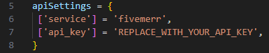

# 💪 power\_dashcams

Make sure to use the latest release of Power Dashcams V2 available on Keymaster.

Create a VIDEO API key and add it to server_functions.lua line 7.
FivemMerr is selected as the API service by default.

<figure><figcaption>
Add VIDEO API Key
</figcaption></figure>

&#x20;Your recorded videos will now be uploaded to FiveMerr and available in game within your dashcam tablet!\
